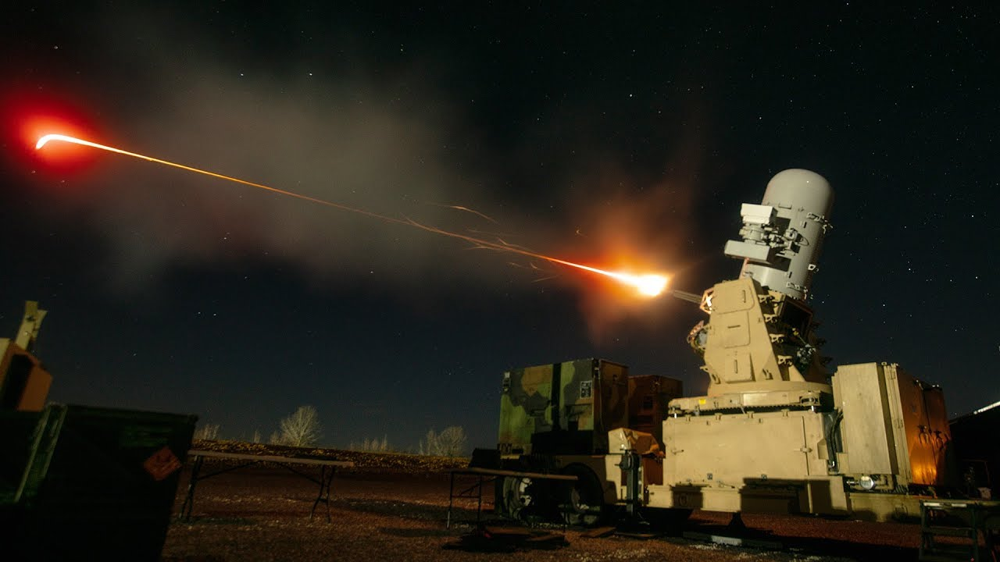
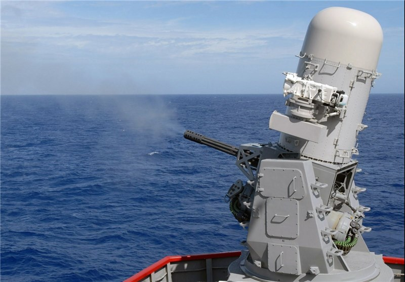

# Comtemporary Defense Turrets
## Introducing the C-RAM

The C-RAM, short for "Counter Rocket, Artillery, and Mortar," is a military air defense system. It is basically a computer-aimed 20 mm gatling gun turret that sprays bullets at hostile projectiles to neutralize them. It shoots 50 rounds per second, and each round costs about $30. Thus, it costs about $1,500 per second to shoot. To put this into perspective, Jeff Bezos, the world's righest man, makes about $2,219 per second, and he would have to spend over 2/3 of his salary to fund continuous firing of this weapon. While this seems ridiculously expensive, it can neutralize many explosive projectiles from over 5 kilometers and potentially save the lives of our country's soldiers. Spending a few thousand dollars to prevent destruction and gory death is definitely a worthwhile cause.
See [America's Tax Dollars at Work.](https://en.wikipedia.org/wiki/Counter_rocket,_artillery,_and_mortar)
## CIWS: Bringing Air Defense to the Sea

The CIWS is a naval adaptation of the C-RAM. It is mounted on ships such as aircraft carriers, and serves as the last line of defense. It can fire at anti-ship missiles, small hostile vessels, and even potentially low-flying aircraft. Small craft attackers may be able to outmaneuver the flghter planes launched from the aircraft carriers, but they're not getting past a 3000 rpm computer-aimed salvo of bullets fired at close range.
